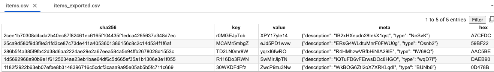

# CSV to SQL Pipeline with SHA-256 Hash Generation

This project demonstrates an end-to-end process for generating random data, computing SHA-256 hashes, converting the data to a CSV file, importing it into a SQL database, and exporting it back to CSV. The pipeline ensures data integrity and facilitates seamless data processing and transfer between formats.

## Message Structure

<pre>
message Item (   
  Bytes    key,
  Bytes    value,
  Metadata metadata,
  Hex  chunk
)
</pre>

The message struct is generated in yaml, then translated to a csv (retaining the fields: id_hash_sha256, key, value, meta,  hex).

The csv is piped (importable) to sql. 
A search based on the hash keys are conducted, then exported (exportable) to another csv.

yaml file converted to csv, then inserted to sql, and exported out to csv:

